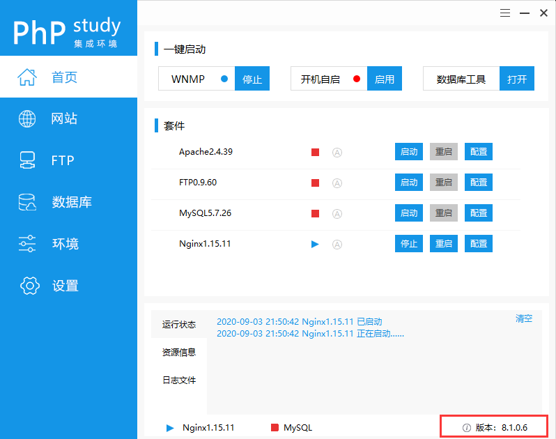
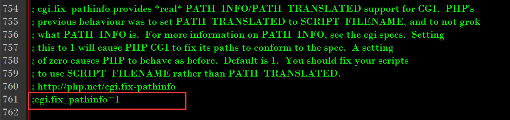
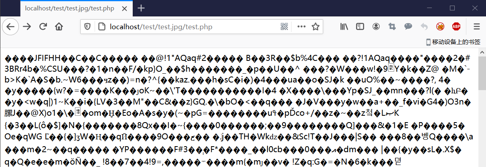
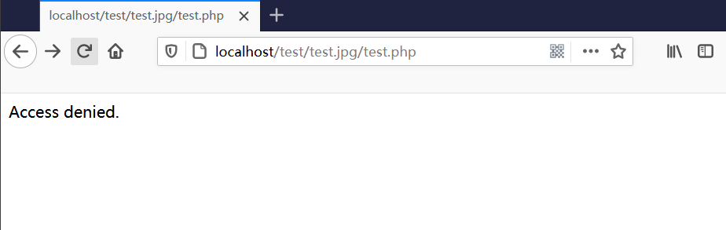
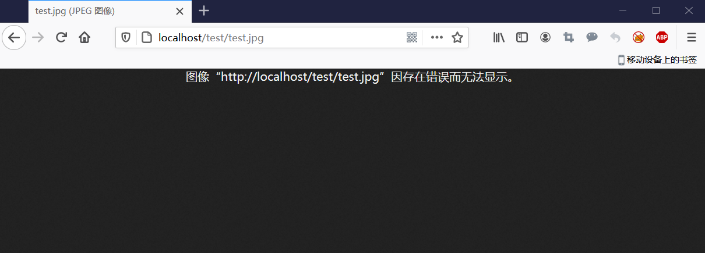
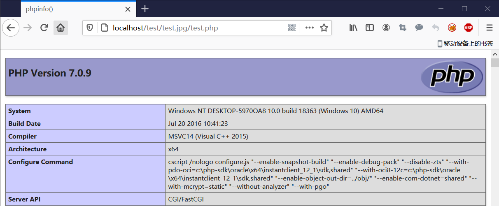
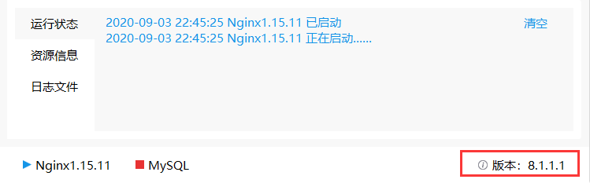
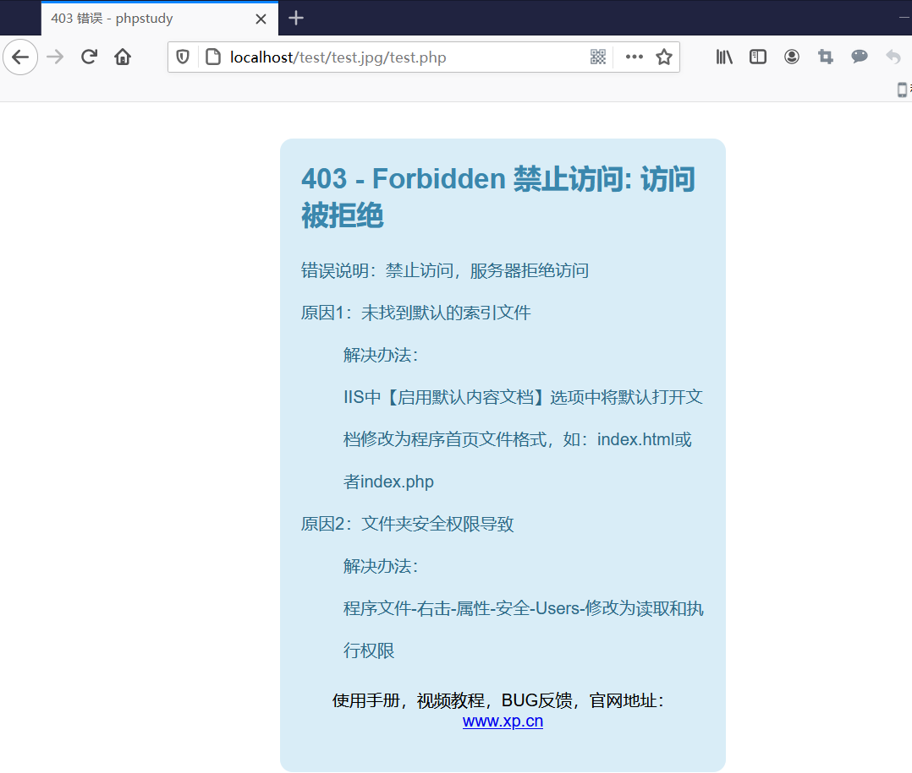

# phpStudy Nginx解析漏洞


## 漏洞概述

**漏洞名称**

phpStudy Nginx解析漏洞

**漏洞编号**

无

**漏洞评级**

高危

**漏洞描述**

phpStudy存在nginx解析漏洞，攻击者能够利用上传功能，将包含恶意代码的合法文件类型上传至服务器，从而造成任意代码执行的影响。

**影响范围**

phpStudy Windows版 <= 8.1.0.7


## 环境准备

在Windows上安装低于8.1.0.7的版本，我的版本是8.1.0.6，启动Nginx服务：




## 漏洞原理

我phpStudy中正在启用的PHP版本是php7.0.9nts，查看该版本的php.ini文件：



漏洞发生的原因就在于cgi.fix_pathinfo选项，当此选项设置为1时，PHP CGI将对文件路径进行修复，当文件路径不存在时，将返回上一层路径。因此假设一个路径/test.jpg/test.php，当检测到test.php不存在时，将返回上一层解析test.jpg文件。

如下所示，访问/test.jpg/test.php文件：



图片并没有显示出来，而是被fastcgi解析了。

去掉注释，将cgi.fix_pathinfo设置为0，重启Nginx服务，再次访问/test.jpg/test.php文件：



发现不再对路径进行修复了，因此也不会解析test.jpg的内容。

# 漏洞利用

在网站目录下新建文件test.jpg，内容如下：

```php
<?php phpinfo(); ?>
```

直接用浏览器访问文件是无法解析的：



利用Nginx解析漏洞，后面跟上/test.php后解析成功：




# 修复建议

phpSutdy已经发布了新版本，更新后版本为8.1.1.1：



再次尝试利用漏洞，发现已经无法解析了：




# 参考文档

https://www.anquanke.com/post/id/216473